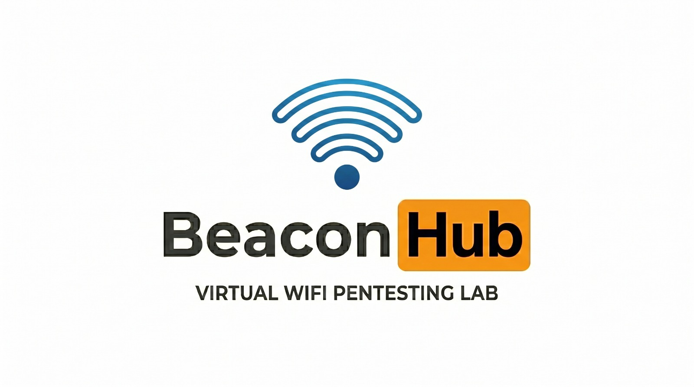
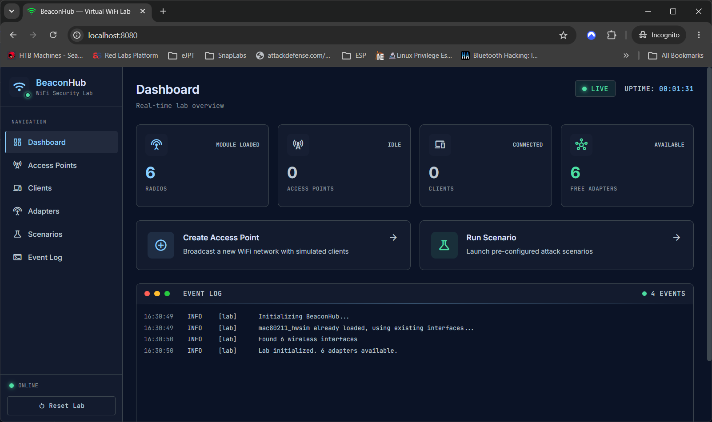
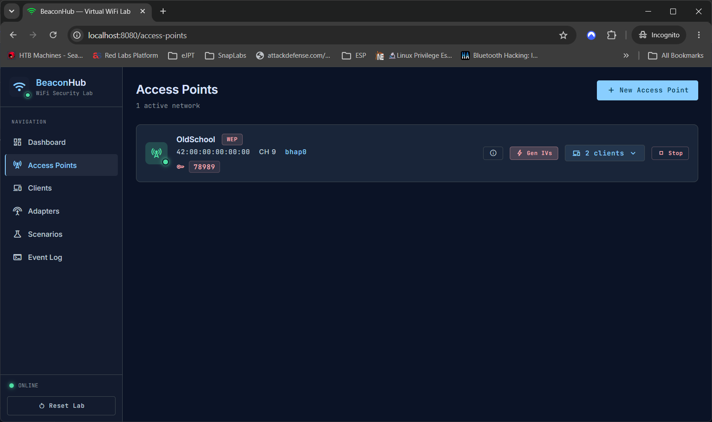
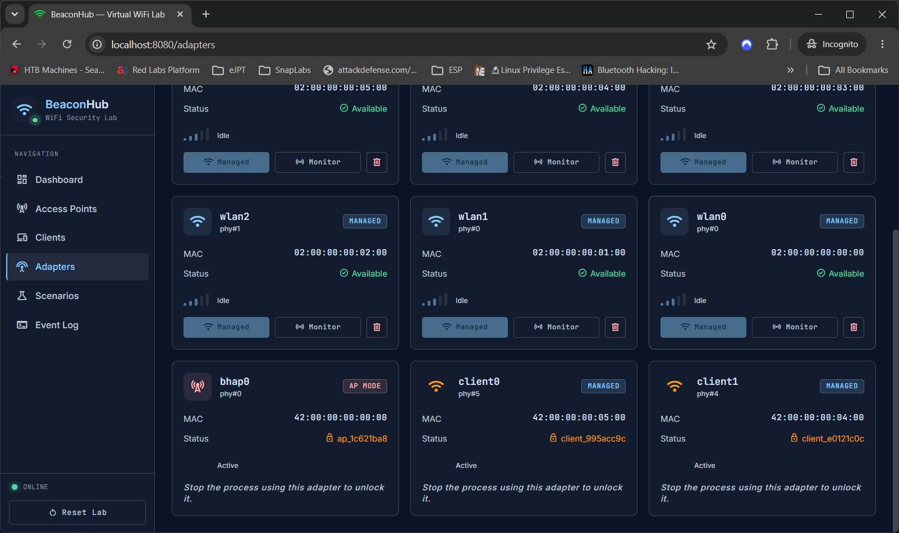

# Beacon Hub



Beacon Hub is a virtual Wi-Fi penetration testing lab for learning and practicing wireless security in a safe local environment.

It runs inside a lightweight Debian virtual machine and uses Linux wireless simulation (`mac80211_hwsim`), so you can create access points, clients, captures, and attacks without buying external Wi-Fi adapters or testing on real networks.

The project is built for education, practice, and demonstrations.

## What You Can Test

Beacon Hub currently supports practical lab workflows for:

- WPA2-PSK networks
- WEP networks
- WPA2-Enterprise networks
- Virtual access points and virtual clients
- Monitor mode adapters
- Deauthentication testing
- WPA handshake capture
- WEP IV capture and cracking workflow
- Packet capture and live lab logs
- Guided training scenarios

Future versions are planned to support more attack and defense labs, including MITM, spoofing, session hijacking, evil twin portals, captive portal workflows, and more advanced wireless security scenarios.

## Screenshots

### Home Dashboard



### Access Point Deployment



### Virtual Adapters



## Why Beacon Hub?

Learning Wi-Fi security usually needs extra hardware, compatible chipsets, antennas, and a safe test network. Beacon Hub keeps the learning environment local and virtual.

You can run the lab on your own machine, open the web interface, create test networks, connect simulated clients, and practice common Wi-Fi attacks without touching any real network.

The virtual networks created inside Beacon Hub are not visible to nearby phones, laptops, or routers. They are created inside the Linux VM for lab practice only, so the assessment stays inside your own machine.

## Beginner Explanation

Beacon Hub may look like a Wi-Fi lab, but it does not need a real Wi-Fi adapter. It works by combining a few Linux tools:

- **Vagrant** creates and manages the virtual machine. Instead of manually installing Debian and configuring everything, you run `vagrant up` and the project builds the lab for you.
- **VirtualBox** runs the Debian virtual machine on your computer.
- **`mac80211_hwsim`** is a Linux kernel module that creates virtual Wi-Fi radios. These behave like Wi-Fi adapters inside Linux, but they do not send real wireless signals outside your computer.
- **`hostapd`** creates virtual access points. This is how Beacon Hub can create WPA2, WEP, open, and enterprise-style Wi-Fi networks inside the lab.
- **`dnsmasq`** gives connected virtual clients IP addresses, similar to how a normal home router gives IP addresses to phones and laptops.
- **`wpa_supplicant`** helps simulate Wi-Fi clients connecting to those virtual networks.
- **`aircrack-ng`** and related tools are used for learning capture, deauthentication, WEP, and WPA handshake workflows.

So the project is basically a small virtual Wi-Fi world: virtual adapters, virtual routers, virtual clients, and security tools, all running locally.

## Requirements

Minimum recommended host machine:

- VirtualBox
- Vagrant
- 2 CPU cores available for the VM
- 2 GB RAM available for the VM
- Internet connection for first-time setup
- A few GB of free disk space for the VM, packages, captures, and tools

The Vagrant configuration allocates:

- 2 GB RAM
- 2 virtual CPUs
- Debian Bookworm 64-bit base box
- Web UI forwarded to `http://localhost:8080`

The first setup downloads the Debian box, around 500-600 MB, plus additional packages and security tools during provisioning.

## Installation

Clone the project and start the VM:

```bash
cd BeaconHub
vagrant up
```

After cloning the repository, `vagrant up` is the main setup command. Vagrant will download the base VM, install dependencies, build the frontend, configure the backend service, and expose the lab on your local machine.

When setup finishes, open:

```text
http://localhost:8080
```

The lab is configured to auto-start inside the VM.

## Basic Usage

Enter the VM:

```bash
vagrant ssh
```

Check the lab:

```bash
beaconhub status
```

Start the lab manually if needed:

```bash
beaconhub start
```

Stop the lab:

```bash
beaconhub stop
```

List installed Wi-Fi tools:

```bash
beaconhub tools
```

Run a simple test:

```bash
beaconhub test
```

## How It Works

Beacon Hub runs a full local lab inside the Vagrant VM.

- The frontend is a React web interface served through nginx.
- The backend is a FastAPI application running inside the VM.
- Virtual Wi-Fi radios are created with `mac80211_hwsim`.
- Access points are managed with `hostapd`.
- DHCP and client networking are handled with `dnsmasq` and Linux networking tools.
- Captures and attacks use tools from the aircrack-ng suite.
- The host machine accesses the UI through port `8080`.

In simple terms, your browser talks to the Beacon Hub API, and the API controls the simulated Wi-Fi lab inside the VM.

## Backend Technologies

Beacon Hub uses a small backend stack so the lab can be controlled from the browser while the real Wi-Fi simulation runs inside Linux.

- **Python** is used for the backend because it is simple, readable, and works well with Linux networking tools.
- **FastAPI** provides the REST API used by the web interface. When you click buttons in the browser, FastAPI receives those requests and calls the lab control logic.
- **Uvicorn** runs the FastAPI app. It is an ASGI server, which means it is the process that actually starts the backend and keeps the API listening inside the VM on port `8000`.
- **Pydantic** is used by FastAPI to validate request and response data, such as access point settings, client settings, adapter modes, and attack requests.
- **WebSockets** are used for live updates, so the frontend can receive logs and lab events without refreshing the page.
- **systemd** manages the Beacon Hub backend service inside the VM. This lets the backend start automatically when the VM boots.
- **nginx** serves the built frontend and forwards API requests from the browser to the backend.
- **Shell scripts** in the `scripts/` folder provide simple VM commands like `beaconhub start`, `beaconhub stop`, `beaconhub status`, and helper attack workflows.

## Adapter Design

Beacon Hub keeps access points, clients, and attack adapters separate so the lab stays easier to understand and more stable.

- When a new access point is created, Beacon Hub assigns a virtual Wi-Fi adapter for that AP.
- When virtual clients are created, they also use their own client-side virtual adapters.
- Adapters that are not being used by an AP or client can be switched into monitor mode and used for testing attacks or captures.
- This separation avoids mixing AP traffic, client traffic, and attack traffic on the same interface.

This design is close to how a real Wi-Fi lab would be organized: one adapter may run an access point, another may act as a client, and another may be used for monitor mode or packet capture.

## Included Tools

Beacon Hub installs a small set of useful tools for the lab, including:

- `hostapd`
- `dnsmasq`
- `aircrack-ng`
- `iw`
- `wpa_supplicant`
- `tshark`
- `tcpdump`
- `hashcat`
- `reaver`
- `bully`
- `mdk4`
- `pixiewps`
- `cowpatty`
- `hcxtools`
- `hcxdumptool`
- `wifite`
- `airgeddon`
- `wifiphisher`
- `eaphammer`

You can install more tools inside the Debian VM if your own lab work needs them.

## Project Structure

```text
backend/      FastAPI backend and lab control logic
frontend/     React web interface
scripts/      VM helper scripts and attack helpers
configs/      nginx and service configuration
wordlists/    small wordlists for local testing
Vagrantfile   VM setup and provisioning
```

## Common Commands

```bash
# Start the VM
vagrant up

# Enter the VM
vagrant ssh

# Start Beacon Hub
beaconhub start

# Check status
beaconhub status

# Stop Beacon Hub
beaconhub stop

# Stop the VM
vagrant halt

# Remove the VM completely
vagrant destroy
```

## Notes

- Beacon Hub is a virtual lab. It does not transmit real Wi-Fi radio signals.
- Results are meant for learning and controlled testing.
- Some tools are included for convenience, but the main value of the project is the virtual lab environment.
- The project should only be used on systems and networks you own or have permission to test.

## License and Disclaimer

Beacon Hub is intended for educational and authorized security testing only.

Do not use these techniques against networks, devices, or users without clear permission.
